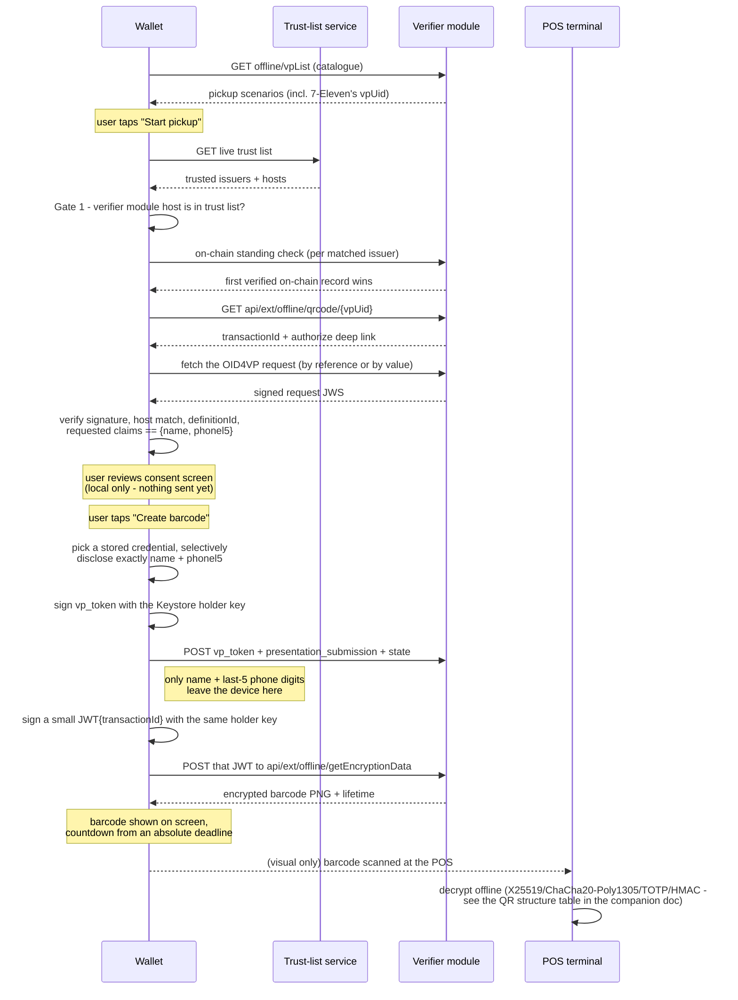

# 7-Eleven pickup: as-built data flow (2026-09-10)

What actually moves where in the live pickup flow, traced from the
current implementation (`PickupScreen.kt` → `PickupClient.kt` →
`core::twdiw::convenience_store_pickup`/`core::ffi`). Companion to
`docs/2026-09-05-telecom-pickup-notes.md`, which covers the *protocol
design* (why each step exists, open questions, security posture) from
an external field report written before this flow was built. This
doc is the *as-built* trace through the real code — read the other
one first for context, this one for "what's actually in each
request."

## Actors

- **Wallet** (this app) — holds the stored telecom credential and the
  device Keystore private key that never leaves it.
- **Verifier module** — the 7-Eleven pickup service named in the
  offline-verifier catalogue (`scenario.verifierModuleUrl`); issues
  the transaction, checks the presentation, and issues the barcode.
- **Trust-list service** (`frontend.wallet.gov.tw`) — independent of
  the verifier module; the wallet cross-checks the verifier against
  this before trusting anything it says.
- **POS terminal** — decrypts the barcode offline; never talks to the
  wallet directly, only ever scans what's on screen.

## Sequence

## What crosses the network, and when

| Step | Direction | Payload | Carries disclosed personal data? |
|---|---|---|---|
| Catalogue fetch | W → V | none (GET) | No |
| Trust list fetch | W → T | none (GET) | No |
| On-chain standing check | W → V | issuer identifiers | No |
| Start transaction | W → V | none (GET) | No |
| Fetch OID4VP request | W → V | none (GET/by-value) | No |
| **Present credential** | W → V | `vp_token` (signed, selectively-disclosed credential), `presentation_submission`, `state` | **Yes — name + last-5 phone digits, inside the signed VP** |
| Request barcode | W → V | `{jwt}` — ES256 JWT over `transactionId`, signed with the same holder key | No (proves transaction ownership, discloses nothing new) |
| Barcode reply | V → W | encrypted PNG + lifetime | Encrypted — see the QR structure table below |
| POS scan | W → P | the PNG's pixels only, no network call | Encrypted; decrypted offline at the POS |

Everything up through "Start transaction" and "Fetch OID4VP request"
is discovery/verification — no data about the holder leaves the
device. The **only** point personal data leaves the device unencrypted
(over TLS, but not further wrapped) is the `vp_token` POST — and even
there, it's exactly two fields (`name`, `phonel5`), never the whole
credential. The barcode that comes back is itself encrypted a second
time (ChaCha20-Poly1305 inside the PNG payload — see
`docs/2026-09-05-telecom-pickup-notes.md`'s QR structure table) so
that the POS can validate it with no network call of its own.

## What never leaves the device

- The full stored credential (`CredentialStore` — `EncryptedFile` on
  disk; only the two consented claims are ever serialised out via
  `reserialiseTwdiwCredential`).
- The Keystore private key (`KeystoreHolderKey`) — every signature
  (`vp_token`, the barcode-request JWT) is produced in place via
  `signRaw`; the key material itself is non-exportable by construction
  (Android Keystore).
- Any claim other than `name`/`phonel5`, even if the stored credential
  has more disclosed claims available (`matchAndDisclose` intersects
  the descriptor's requested claims with the fixed `{name, phonel5}`
  set, not "whatever's available").

## Where each step's logic actually lives

| Concern | Lives in |
|---|---|
| Catalogue/start/barcode JSON parsing, countdown math | `core::twdiw::convenience_store_pickup` (Rust, FFI-exported) |
| OID4VP request signature verification, trust-list gate 1 | `core` (shared with the receive flow's own gates) |
| On-chain standing check | `OnChainVerifier.kt` (native — calls out to the Arbitrum RPC) |
| Which stored credential answers a request, and what it discloses | `PickupClient.matchAndDisclose` (Kotlin, **not** ported to `core` — needs the native `CredentialStore`) |
| Signing (`vp_token`, barcode-request JWT) | `KeystoreHolderKey` (Kotlin, Android Keystore) |
| HTTP itself | `TwdiwClient` (Kotlin, plain OkHttp-style client) |

`PickupClient`'s own doc comment calls out the same boundary: crypto
and protocol logic that doesn't need the credential store or Keystore
is in `core`; the credential-selection and signing steps that
genuinely need native, on-device capability are written directly in
`PickupClient.kt`.

## See also

- `docs/2026-09-05-telecom-pickup-notes.md` — protocol design,
  security posture, the QR's internal `t`/`d`/`h`/`k` field structure,
  and open questions from the source field report (several of which
  this implementation has since resolved by matching the iOS port's
  behavior — worth reconciling if that doc is revisited).
